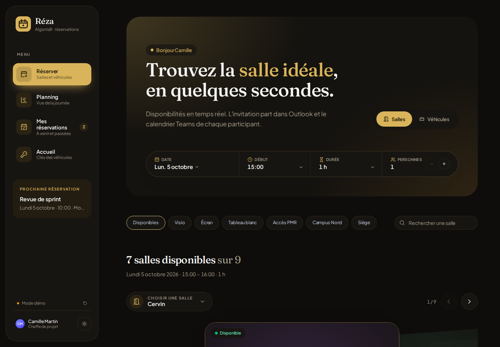
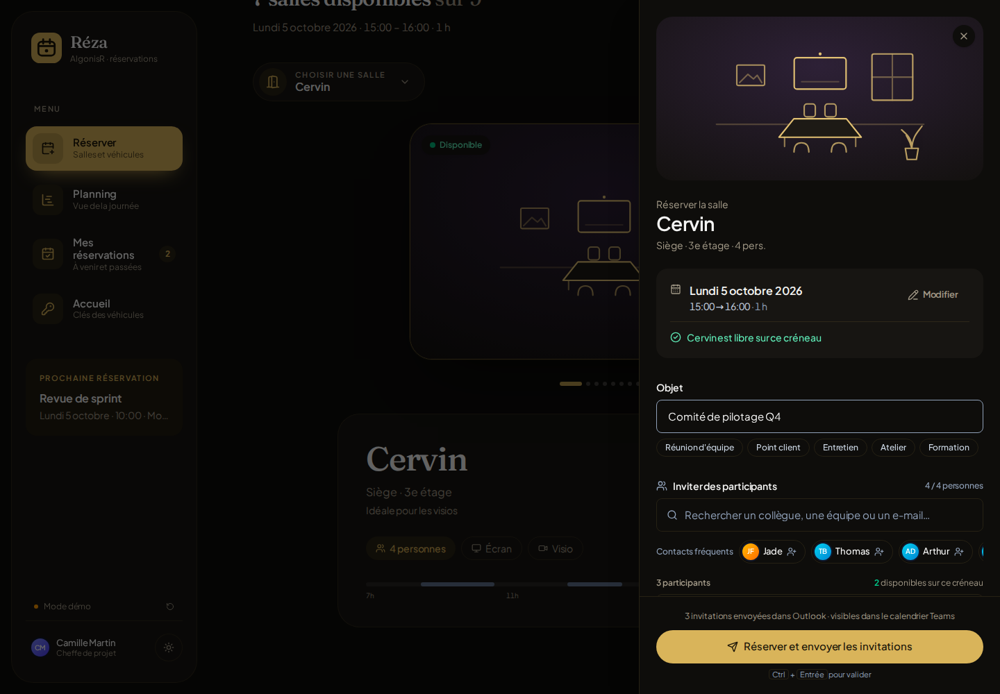
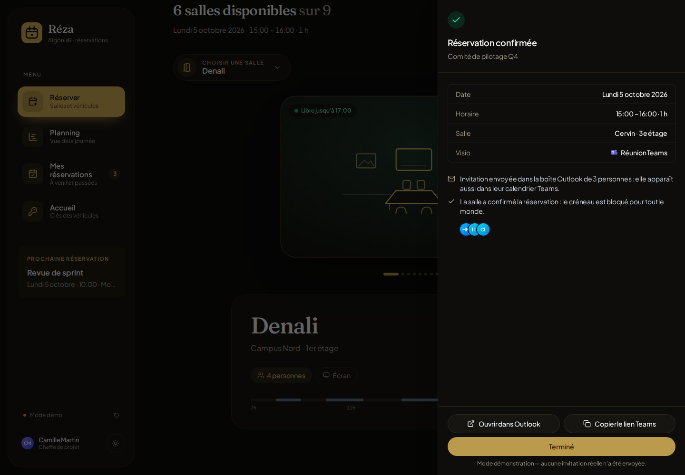
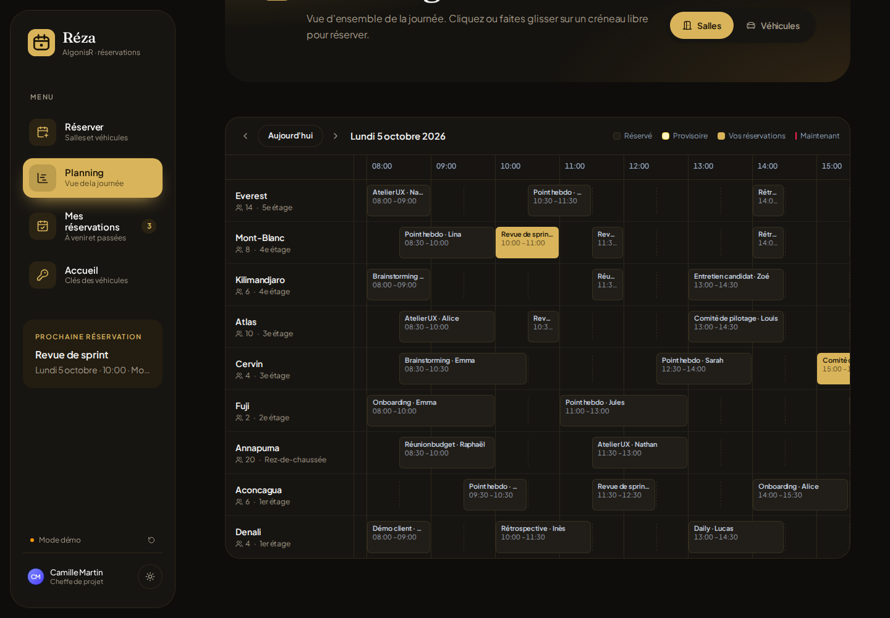
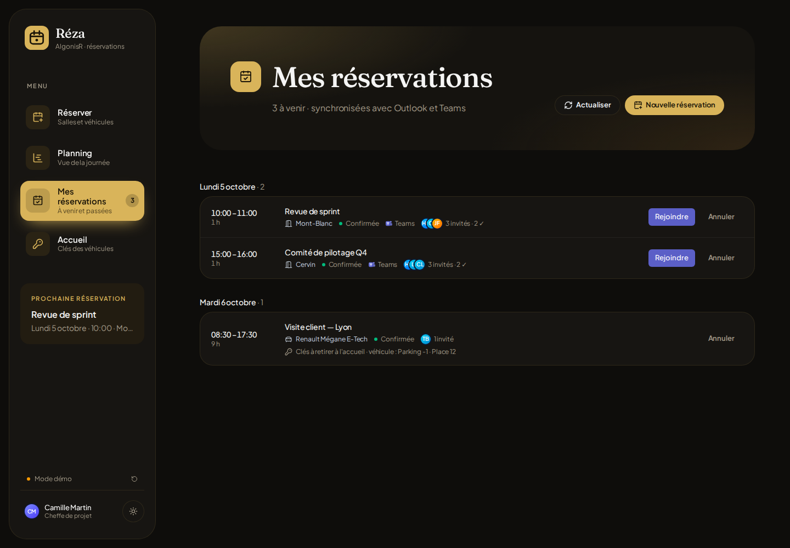
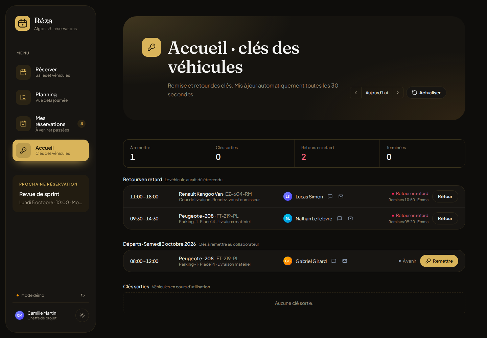
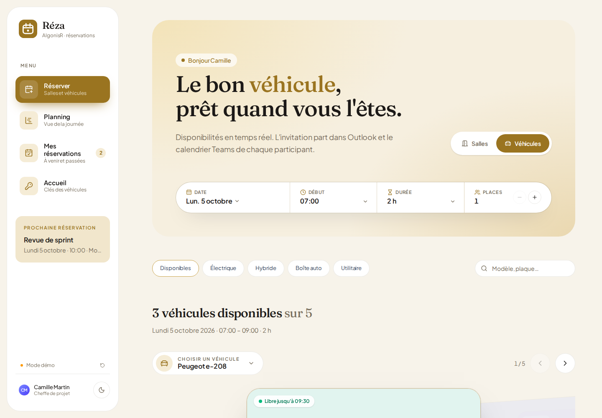
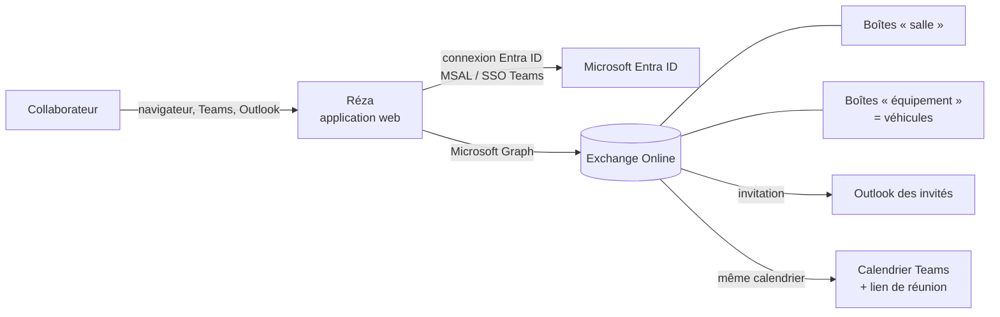

# Réza — Réservation de salles et de véhicules pour Microsoft 365

> Choisissez un créneau, voyez instantanément ce qui est libre, réservez en un clic.
> Les invitations partent dans **Outlook**, avec un lien de réunion **Teams**, et apparaissent dans le **calendrier Teams** de chaque participant.



## Fonctionnalités

| | |
|---|---|
| ⚡ **Disponibilités en temps réel** | Les salles et véhicules libres sur votre créneau apparaissent en premier, avec une frise de la journée et le prochain créneau libre si c'est complet. |
| ✉️ **Invitations Outlook automatiques** | La réservation crée un vrai événement Exchange : chaque participant le reçoit dans sa boîte Outlook. |
| 🟣 **Réunion Teams en un clic** | Lien « Rejoindre » ajouté à l'invitation ; l'événement apparaît dans le calendrier Teams. |
| 👥 **Invités intelligents** | Suggestions de collègues fréquents, recherche dans l'annuaire, groupes, adresses externes, collage d'une liste d'e-mails, et **disponibilité de chaque invité** affichée en direct. |
| 🚗 **Salles et véhicules** | Les véhicules de la flotte se réservent comme les salles (sur plusieurs jours si besoin). |
| 🗓️ **Planning visuel** | Vue « Gantt » de toutes les ressources : cliquez ou glissez sur un créneau libre pour réserver. |
| 🔑 **Accueil · clés des véhicules** | Espace réservé à l'accueil : départs du jour, remise et retour des clés (heure, kilométrage, état), retours en retard signalés. |
| 🔒 **Zéro double réservation** | Revérification en direct, confirmation par Exchange avant l'envoi des invitations, annulation automatique si le créneau a été pris entre-temps, règles (pas de passé, durée maximale, un seul véhicule à la fois par personne). |
| 📋 **Mes réservations** | Rejoindre la réunion Teams, ouvrir dans Outlook, voir qui a accepté, annuler (les invités sont prévenus). |
| 🧩 **Dans Teams et Outlook** | L'application s'installe dans Teams, Outlook et l'application Microsoft 365, avec authentification unique (aucune connexion supplémentaire). |
| 🎨 **Noir et or** | Thème sombre doré par défaut, carrousel 3D des salles et véhicules, thème clair ivoire au choix (, suit Teams dans Teams), mobile, accessible au clavier. |

<table>
  <tr>
    <td></td>
    <td></td>
  </tr>
  <tr>
    <td></td>
    <td></td>
  </tr>
  <tr>
    <td></td>
    <td></td>
  </tr>
</table>

## Essayer tout de suite (mode démo)

Prérequis : [Node.js 20+](https://nodejs.org).

```bash
npm install
npm run dev
```

Ouvrez <http://localhost:5173>. Sans configuration Microsoft 365, l'application démarre en **mode démo** avec des salles, véhicules et collègues fictifs : tout le parcours est utilisable, rien n'est envoyé.

## Comment ça marche



- **Salles** = boîtes aux lettres de *salle* Exchange ; **véhicules** = boîtes aux lettres d'*équipement*. Elles acceptent automatiquement les réservations et refusent les doublons.
- Réza appelle **Microsoft Graph au nom de l'utilisateur connecté** (autorisations déléguées) : disponibilités (`getSchedule`), création de l'événement avec la ressource et les invités (`POST /me/events`, réunion Teams incluse), annulation (`/cancel`).
- Le calendrier Teams **est** le calendrier Exchange : une invitation Outlook apparaît automatiquement dans Teams.
- Aucune base de données, aucun serveur : une application web statique, hébergeable gratuitement (Azure Static Web Apps).

## Mise en service dans votre Microsoft 365

Le guide complet, pas à pas, est dans **[docs/INSTALLATION.md](docs/INSTALLATION.md)**. En résumé :

1. **Exchange** — créer les salles et véhicules : `scripts/exchange/New-RezaResources.ps1` (à partir d'un CSV).
2. **Entra ID** — inscrire l'application et accorder le consentement : `scripts/entra/Register-RezaApp.ps1`.
3. **Configurer** — copier `.env.example` en `.env.local`, renseigner l'ID d'application et le tenant ; déclarer les véhicules dans `public/catalog.json`.
4. **Déployer** — `npm run build` puis publier le dossier `dist/` (Azure Static Web Apps conseillé, configuration fournie).
5. **Teams / Outlook** — `npm run teams:package`, puis charger le `.zip` dans le centre d'administration Teams et l'épingler pour tous.

## Configuration

| Variable (`.env.local`) | Rôle |
|---|---|
| `VITE_AZURE_CLIENT_ID` | ID d'application (client) Entra ID. **Vide = mode démo.** |
| `VITE_AZURE_TENANT_ID` | ID du locataire Microsoft 365. |
| `VITE_APP_NAME`, `VITE_COMPANY_NAME` | Nom affiché de l'application et de la société. |
| `VITE_RECEPTION_GROUP_ID`, `VITE_RECEPTION_EMAILS` | Accès à l'espace Accueil (groupe Entra ID et/ou adresses e-mail). |
| `VITE_DAY_START_HOUR`, `VITE_DAY_END_HOUR` | Plage horaire du planning (par défaut 7 h – 20 h). |
| `APP_PUBLIC_URL`, `TEAMS_APP_ID` | Utilisés par `npm run teams:package`. |

**`public/catalog.json`** (modifiable après déploiement, sans recompiler) :

- `rooms.source` : `"places"` (salles lues dans Exchange), `"catalog"` (uniquement ce fichier) ou `"both"` (défaut).
- `rooms.items` : compléter une salle (photo `image`, description, équipements) ou en ajouter une ; `rooms.hide` : masquer des salles.
- `vehicles` : la liste des véhicules (adresse de la boîte « équipement », modèle, immatriculation, places, autonomie, lieu de retrait, photo…).
- Équipements possibles : `screen`, `video`, `whiteboard`, `phone`, `accessible`, `electric`, `hybrid`, `automatic`, `utility`, `gps`.

## Développement

```bash
npm run dev            # serveur de développement (http://localhost:5173)
npm test               # tests unitaires (Vitest)
npm run typecheck      # vérification TypeScript
npm run build          # build de production → dist/
npm run teams:package  # package Teams/Outlook → teams/build/*.zip
```

Ajoutez `?demo` à l'URL pour forcer le mode démo, même lorsqu'une inscription Entra ID est configurée.

```
src/
  pages/        Réserver, Planning, Mes réservations, Connexion
  components/   Cartes, panneau de réservation, sélecteurs, sélection des invités…
  services/     auth (MSAL + SSO Teams/Outlook), graphService (Microsoft Graph), demoService (mode démo)
  lib/          calcul des disponibilités, dates en français
scripts/        package Teams, scripts PowerShell Exchange et Entra ID
teams/          manifeste et icônes de l'application Teams/Outlook
```

Pile technique : React 19, TypeScript, Vite, Tailwind CSS 4, Motion, TanStack Query, MSAL.js 5 (avec *Nested App Authentication* pour Teams/Outlook), TeamsJS.

## Sécurité et confidentialité

- Connexion Microsoft Entra ID (OAuth 2.0 + PKCE) ; aucun mot de passe ni secret dans l'application.
- Autorisations **déléguées** uniquement : chacun ne peut lire et réserver que ce que son compte Microsoft 365 permet déjà.
- Aucune donnée stockée hors de Microsoft 365 ; pas de serveur intermédiaire.
- En-têtes de sécurité stricts (CSP sans script en ligne, HSTS, affichage en iframe limité à Teams/Outlook/Microsoft 365) fournis pour Vercel (`vercel.json`) et Azure (`staticwebapp.config.json`).
- Double réservation impossible : voir [« Sécurité » dans le guide d'installation](docs/INSTALLATION.md#sécurité--comment-la-double-réservation-est-empêchée).
